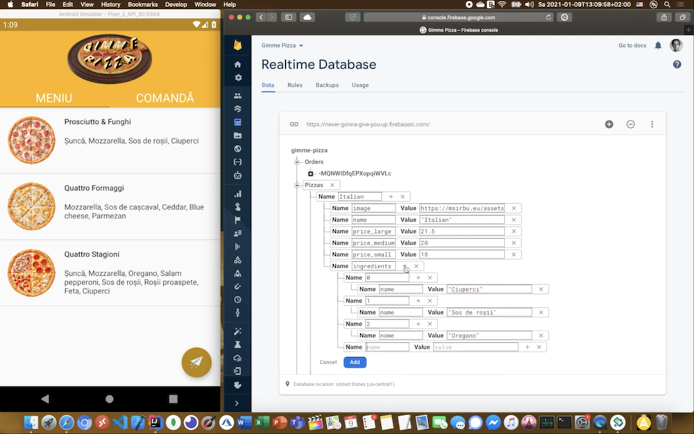

# _Gimme Pizza_: pizza ordering app

This is _Gimme Pizza_, an Android boilerplate pizza ordering app, implemented with Java, compatible with Android 4.4 KitKat and above. Coded for the Mobile App Development course of UniTBv. See the app in action [here](https://youtube.com/embed/xCThSvJJVcM).

## Configuration

Create a Google Firebase Realtime Database and populate it with data, as exemplified above. Export the `google-services.json` configuration file and overwrite the placeholder that currently resides inside `/app`. Replace the branding assets with the ones of your choice.

## Attributions

The isometric letters included in the Gimme Pizza logo: [Background vector created by vectorpouch - www.freepik.com](https://www.freepik.com/vectors/background)